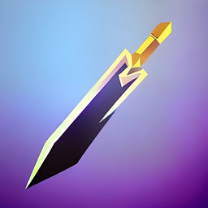
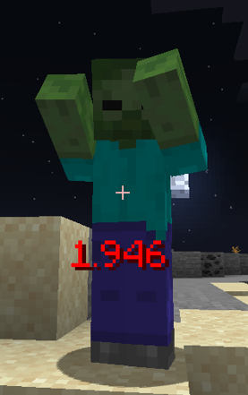

# Reach Display

A configurable visual representation of your reach and hit distances.

The goal of this mod is to display the distance between you and the entity you are looking at, and to show how far your hits reached. It is useful for controlling combo distances and aligning look angles to optimise the distance. Everything is configurable: text size, color, placement, shadow, decimal places.

## Screenshots

## Features

### Distance

Displays the distance from your eye to the enemy hitbox.

### Hit Distance

Displays the distance of your last hit.

### Average Hit Distance

The average of either the last X hits or the local/global session hit distances.

### Entity Filter

Controls which entities are measured. Available in whitelist or blacklist mode with per-category toggles:

- Players
- Hostile mobs
- Passive mobs
- Boss mobs
- Other mobs
- Custom entity IDs (comma-separated, e.g. `minecraft:zombie`)

The filter applies to all three displays.

## Installation

1. Install Fabric Loader for your Minecraft version.
2. Download the jar for your version from [Modrinth](https://modrinth.com/mod/reach-display) or [CurseForge](https://www.curseforge.com/minecraft/mc-mods/reach-display).
3. Drop the jar into your `mods` folder.

Required dependencies:

- [Fabric API](https://modrinth.com/mod/fabric-api)
- [MidnightLib](https://modrinth.com/mod/midnightlib)

[Mod Menu](https://modrinth.com/mod/modmenu) is recommended: it provides the entry point for the config screen.

## Compatibility

| Minecraft | Mod version | Loader |
|---|---|---|
| 1.18.2 | 3.0.0-1.18.2 | Fabric |
| 1.19.4 | 3.0.0-1.19.4 | Fabric |
| 1.20.1 | 3.0.0-1.20.1 | Fabric |
| 1.21.11 | 3.0.0-1.21.11 | Fabric |
| 26.1.2 | 3.0.0-26.1.2 | Fabric |

Requires Java 21 (1.18.2-1.21.11) or Java 25 (26.1.2). Client-side mod; no server-side installation needed.

## Configuration

Open the config screen through Mod Menu, or edit `config/reach_display.json`. All three displays share the same style options:

- Scale, X and Y offset, color, opacity, text shadow, decimal places
- Bold, italic, underline
- Display mode: number only, with blocks, with meters
- Distance calculation method: ray hit point or closest point
- Color bands with per-band thresholds and colors
- Color gradient between start and end colors, with a configurable max distance (defaults to the 3 block reach, 5 in creative)
- Background with configurable color and opacity
- Smooth interpolation and update rate (distance display)

The average hit display additionally selects between averaging the last N hits, the local session, or the global session.

## Limitations

- Distance is measured from the eye to the entity hitbox, not the server's actual hit registration distance.
- Boss classification matches the Ender Dragon, Wither, and Warden by class name; modded bosses may classify as Other mobs.
- The hit and average displays share the keep-last-distance and reset-time settings.

## Future

I will continue supporting the mod for 1.17+. If you would like more options added, please request them.

## Contributing

See [CONTRIBUTING.md](CONTRIBUTING.md). Issues and feature requests go to the [issue tracker](https://github.com/Wolren/ReachDisplay/issues).

## Security

See [SECURITY.md](SECURITY.md) for the security policy.

## License

Reach Display v3.0.0 and later: All Rights Reserved. Versions before 3.0.0: GPL-3.0. See [LICENSE](LICENSE) for details.
